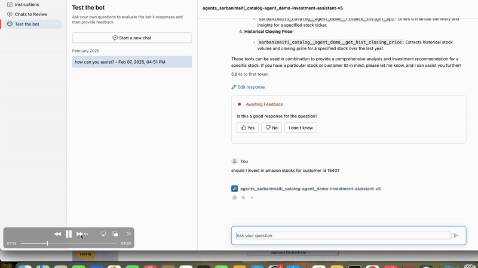

# 💼 Investment Assistant using Databricks Mosaic AI Agent Framework

A domain-specific AI assistant built with the [Databricks Mosaic AI Agent Framework](https://www.databricks.com/blog/mosaic-ai-agents) to help portfolio managers make informed stock investment decisions using real-time data, user preferences, and historical market trends.

Inspired by:  
➡️ [Building an Investment Assistant with the Databricks Mosaic AI Agent Framework](https://medium.com/@AI-on-Databricks/building-an-investment-assistant-with-the-databricks-mosaic-ai-agent-framework-d2ff276a61d2)

---

## 🚀 Key Features

- 🔍 **Real-Time Stock Data**: Uses Yahoo Finance API to fetch current stock info.
- 🧠 **LLM Agent for Investment Decisions**: Combines financial data, user risk profiles, and natural language prompts to produce Buy/Sell/Hold recommendations.
- 📊 **Delta Table Integration**: Historical prices and synthetic customer preference data loaded from Unity Catalog Delta tables.
- 📈 **Agent Evaluation**: Tracks cost, latency, grounding quality, and approval through Mosaic AI's built-in evaluation and review tools.
- 🔁 **Human-in-the-Loop**: Integrated with Review App for gathering human feedback and improving model output quality.
- 🏗 **Production-Ready**: Deployed via Databricks Model Serving with full observability and governance.

---

## 🏗 Architecture Overview

```text
[User Prompt] ──▶ [LLM Agent]
     │
     ├──▶ [Yahoo Finance API]
     ├──▶ [Historical Data via Delta Table]
     └──▶ [Customer Preferences via Delta Table]
        ↓
[Recommendation + Rationale]
        ↓
[Trace logged to MLflow] ──▶ [Review App] ──▶ [Evaluation + Fine-tuning]
```


## Demo




[](https://youtu.be/U1gPCrLHYNM)
---

## 🚀 What This Demo Covers

- 🔍 **Real-Time Stock Data**: Integrated with Yahoo Finance API for up-to-date market data  
- 🧠 **LLM-Driven Decision Engine**: Contextual Buy/Sell/Hold decisions based on user profiles and historical trends  
- 📊 **Delta Tables + Unity Catalog**: Used for storing and querying synthetic investor data and historical prices  
- 🔁 **Human-in-the-Loop Feedback**: Review App integration to evaluate and improve agent outputs  
- ✅ **Agent Evaluation Metrics**: Track latency, cost, grounding quality, and approval  
- 🏗 **Production-Ready Deployment**: Model deployed using Databricks Model Serving with governance and observability

---
## 🎯 Who Is This For?
- Portfolio Managers and Financial Analysts  
- GenAI Practitioners building LLM-based decision tools  
- Databricks and Mosaic AI developers  
- Anyone interested in finance + AI

---

